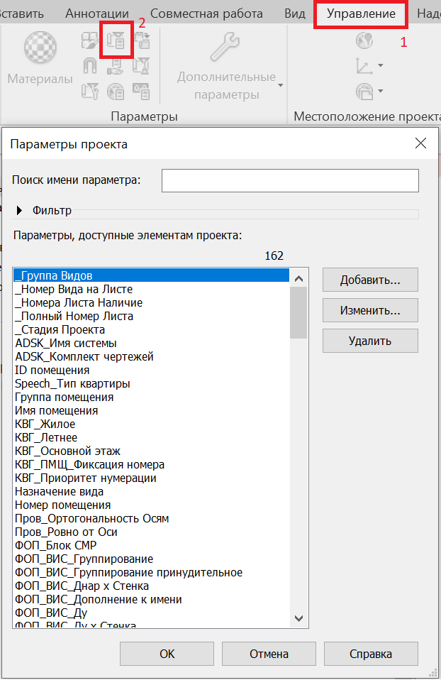

## Введение

В платформе реализован подход с настройкой параметров, которые используются в плагинах.
Это позволяет:
- переносить в проект параметры, используемые платформой;
- централизованно редактировать параметры для всех плагинов в случае их изменения;
- выявлять проблемы при работе с параметрами (например, при несовпадении `StorageType` или при отсутствии параметров 
в проекте);
- предоставлять базовый функционал по работе с параметрами с уже встроенными проверками 
и доп функциями.

Для реализации данного подхода используется:
- ряд классов платформы, через которые производится копирование, настройка, хранение параметров в коде и т.п.
- файл Revit, как шаблон-хранилище, откуда переносятся параметры в проект 
в целевые проекты для последующего использования плагинами.

Классы, отвечающие за работу с параметрами платформы имеют следующую структуру наследования:
- **`RevitParam`**:
  - **`SharedParam`** - класс общего параметра Revit;
  - **`ProjectParam`** - класс параметра проекта Revit;
  - **`SystemParam`** - класс системного параметра Revit.
- **`RevitParamsConfig`**:
  - **`SharedParamsConfig`** - класс конфигурации общих параметров Revit (в нем хранятся общие параметры конфигурации по умолчанию);
  - **`ProjectParamsConfig`** - класс конфигурации параметров проекта Revit (в нем хранятся параметры проекта конфигурации по умолчанию);
  - **`SystemParamsConfig`** - класс конфигурации системных параметров Revit (в нем хранятся системные параметры конфигурации по умолчанию).

## Файл-шаблон Revit

Файл-шаблон Revit используется для хранения и копирования параметров в проект при помощи методов 
платформы. Это сделано из-за того, что программно создавать параметры в проекте Revit сложно, поэтому проще их переносить
из другого проекта.

Файл располагается по пути:  
***%appdata%\pyRevit\Extensions\BIM4Everyone.lib\dosymep_libs\libs\<Revit version>\templates\project_parameters.rvt***

Файл-шаблон можно открыть при помощи кнопки "Открыть шаблон параметров" на вкладке "Admin" платформы в Revit.
Кнопка "Параметры проекта" на вкладке "Управление" позволяет увидеть перечень всех параметров, которые добавлены 
в платформу.



## Конфигурации параметров платформы

Конфигурация параметров - это набор параметров, с которыми работают плагины платформы.

>Конфигурация по умолчанию - конфигурация с параметрами платформы, которые 
>прописаны в коде классов `ProjectParamsConfig`, `SystemParamsConfig` или `SharedParamsConfig`.
 
>Загружаемая конфигурация - конфигурация с параметрами платформы, которые загружаются из стороннего файл в JSON-формате.

Загрузка параметров происходит в файле *startup.py* по пути:
***%appdata%\pyRevit\Extensions\01.BIM.extension***

## Параметры платформы

В платформе есть специальные классы расширения, которые содержат методы по работе с параметрами.

### Использование параметров платформы

Если параметр имеется в конфигурации по умолчанию (прописан в `ProjectParamsConfig`, `SystemParamsConfig` или `SharedParamsConfig`), 
то его можно использовать при разработке плагина путем вызова свойства Instance. 
Например:

**`SharedParamsConfig.Instance.AlbumBlueprints`** - используем конфигурацию для общих параметров (`SharedParamsConfig`), 
поэтому запрос вернет экземпляр класса SharedParam, описывающий общий Revit-параметр, 
под названием _ADSK_Комплект чертежей_. 

В случае, если работа ведется не с конфигурацией по умолчанию, то получить параметр можно обратившись к экземпляру 
конфигурации и указав в квадратных скобках имя параметра (или идентификатор, в зависимости от типа параметра)

Например:  
```
SharedParamsConfig["ADSK_Комплект чертежей"]
```

### Получение значения параметра

**`GetParamValue`** - метод, который возвращает значение параметра элемента.
При использовании в формате:
- **`GetParamValue()`** вернет объект класса `object` (рекомендуется для использования при написании кода на Python);
- **`GetParamValue<string>()`** вернет объект класса `string` (или любой другой, какой будет указан; удобнее, когда известно 
какой тип содержится в параметре).  

Пример:  
```
string levelValue = element.GetParamValue<string>(SharedParamsConfig.Instance.Level)
```

При этом механика работы следующая:
1. Метод пытается получить значение параметра у элемента;
2. Если параметра нет, или значение параметра `null` или пустая строка, то он выбрасывает исключение.

**`GetParamValueOrDefault`** - метод, который возвращает значение параметра элемента, либо значение по умолчанию.
При использовании в формате:
- **`GetParamValueOrDefault()`** вернет объект класса `object` (рекомендуется для использования при написании кода на Python);
- **`GetParamValueOrDefault<string>()`** вернет объект класса `string` (или любой другой, какой будет указан; удобнее, 
когда известно какой тип содержится в параметре).

Пример:  
```
string levelValue = element.GetParamValueOrDefault<string>(SharedParamsConfig.Instance.Level)
```

При этом механика работы следующая:
1. Метод пытается получить значение параметра у элемента
2. Если параметра нет, или значение параметра `null` или пустая строка, то он возвращает значение по умолчанию (с учетом 
типа, если он был передан).

При этом если в аргументах метода указано значение по умолчанию, то в случае возникновения проблем будет возвращено 
не стандартное значение по умолчанию, а то, которое было указано.

Пример:  
```
string levelValue = element.GetParamValueOrDefault<string>(SharedParamsConfig.Instance.Level, "Произошла ошибка!")
```

Также в платформе присутствуют методы для работы со значениями параметров, в случае, когда параметры не принадлежат 
платформе - **`GetSharedParamValue`** (и аналоги) и **`GetProjectParamValue`** (и аналоги).

### Проверка наличия параметра

**`IsExistsParam`** - метод, который проверяет, есть ли параметр у элемента. Возвращает `true`, если есть. При этом проверка
производится через `ParameterBindings` документа. 

Пример:  
```
element.IsExistsParam(SharedParamsConfig.Instance.Level)
```

### Проверка наличия значения параметра

**`IsExistsParamValue`** - метод, который проверяет, содержит ли параметр элемента значение. Возвращает `true`, если содержит.
При этом проверка имеют следующую механику:
1. Проверяется, что у элемента есть параметр;
2. Проверяется, что `HasValue` параметра `true`;
3. Проверяется, что в значение параметра не равно `null` или пустой строке.

Пример:  
```
element.IsExistsParamValue(SharedParamsConfig.Instance.Level)
```

### Загрузка параметров в проект Revit

Для использования параметра плагином может потребоваться сначала загрузить параметр в проект. 
Этот процесс реализуется благодаря файлу Revit, используемому как шаблон, в котором хранятся параметры платформы.
Для копирования и настройки параметров в проекте Revit предназначен класс `ProjectParameters`.  
Методика копирования параметров в нужный проект:
1. На классе `ProjectParameters` вызвать метод `Create` и получить экземпляр класса `ProjectParameters` нужного приложения;
2. Вызвать на нем метод `SetupRevitParam`, чтобы скопировать один параметр в нужный проект;
3. Или вызвать `SetupRevitParams`, чтобы скопировать несколько параметров в нужный проект;
4. После этого платформа найдет указанный параметр в Revit-шаблоне, и произведет копирование в нужный Revit проект.

При этом механизм копирования параметров работает следующим образом:
1. Сначала производится синхронизация параметров, т.е. в случае если в целевом проекте указанный для добавления 
параметр уже присутствует, но в нем отличается список категорий параметра, то нужные категории будут добавлены 
(сниматься галочки категорий не будут);
2. Далее если параметр не был найден в целевом проекте, то производится копирование нужного параметра.