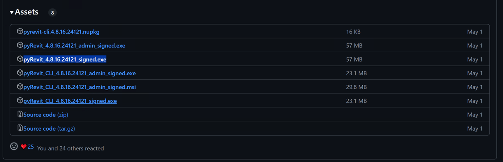
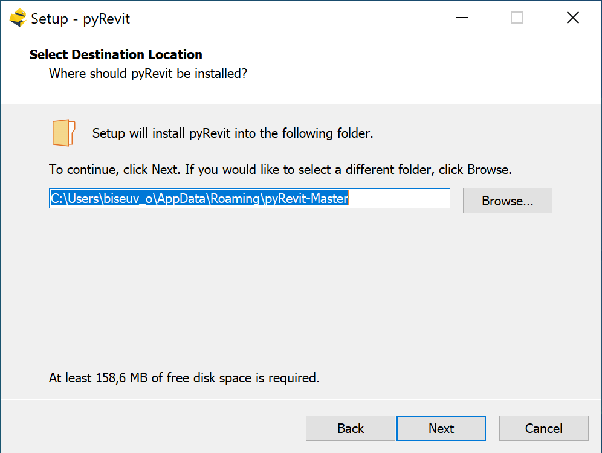
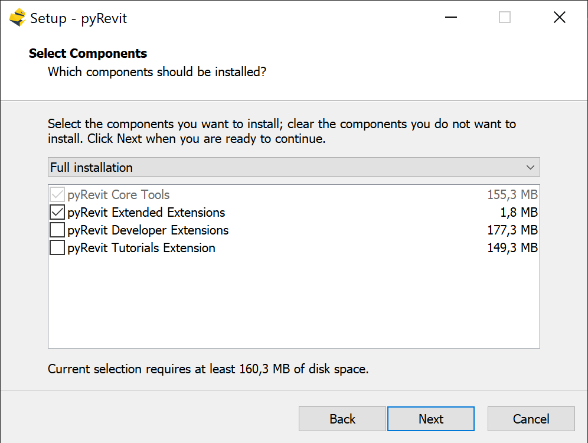
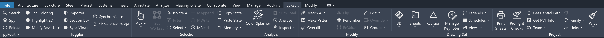
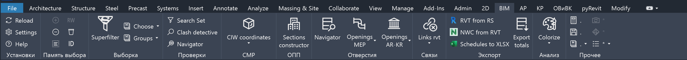

Для успешного начала разработки на нашей платформе необходимо выполнить 
ряд шагов по установке и настройке необходимых инструментов.
Следуйте данной инструкции, чтобы правильно настроить среду для работы 
с Revit и pyRevit.


# Установка pyRevit

1. Перейдите на официальный сайт [pyRevit](https://www.pyrevitlabs.io/) и 
скачайте последнюю версию установщика для пользователя `pyRevit_<version>_signed.exe`.

**pyRevit assets**



2. Запустите установщик и следуйте инструкциям на экране для установки pyRevit.

Выбираем путь до места установки, в нашем случае должна быть папка `%appdata%\pyRevit-Master` как на скриншоте



Выбираем `Full instalation`



3.	После установки откройте Revit и убедитесь, что вкладка pyRevit появилась в интерфейсе.

**pyRevit**


# Установка платформы

1. Запустите PowerShell
2. Запустите следующие команды в PowerShell

Установка вкладки `Admin`

```
pyrevit extend ui 00.Admin "https://www.github.com/Bim4Everyone/AdminExtensions"
```

Установка вкладки `2D`
```
pyrevit extend ui 01.2D "https://www.github.com/Bim4Everyone/2DExtensions"
```

Установка вкладки `BIM`
```
pyrevit extend ui 01.BIM "https://www.github.com/Bim4Everyone/BIMExtensions"
```

Установка вкладки `АР`
```
pyrevit extend ui 02.AR "https://www.github.com/Bim4Everyone/ARExtensions"
```

Установка вкладки `КР`
```
pyrevit extend ui 03.KR "https://www.github.com/Bim4Everyone/KRExtensions"
```

Установка вкладки `ОВиВК`
```
pyrevit extend ui 04.OV-VK "https://www.github.com/Bim4Everyone/HVACExtension"
```

Установка библиотеки `Bim4Everyone`
```
pyrevit extend lib Bim4Everyone "https://www.github.com/Bim4Everyone/Bim4Everyone"
```

3.	После установки откройте Revit и убедитесь, что все установленные вкладки платформы появились в интерфейсе.

**Bim4Everyone**


# Настройка окружения

Доступно в следущей статье: [Настройка окружения](../setup)