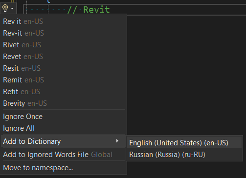
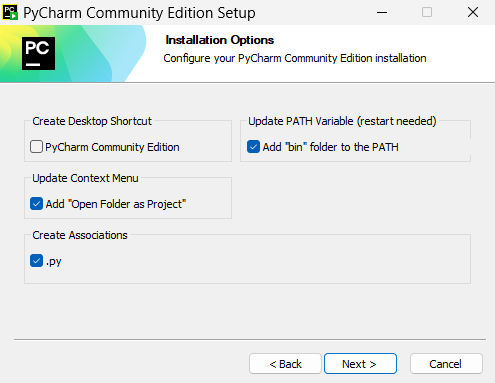

Ниже описаны необходимые и рекомендуемые инструменты для разработки платформы. Убедитесь, что перед началом работы на вашем ПК установлен Autodesk Revit, а также установлена сама платформа Bim4Everyone.

# Установка [Git](https://git-scm.com/)

Перейдите по [ссылке](https://git-scm.com/downloads/win) и скачайте установочный файл Git for Windows. Запустите его и следуйте инструкциям по установке. Если вы незнакомы с [Git](https://git-scm.com/), выбирайте значения по умолчанию. Если вы продвинутый пользователь, вы уже сами знаете, что вам нужно.

`Перезапустите ПК`.

## Настройка Git

Если у вас еще нет аккаунта на [GitHub](https://github.com/), то необходимо его создать.

В ```user.name``` напишите свой логин [GitHub](https://github.com/):

```
git config --global user.name "johndoe"
```

В ```user.email``` напишите свой email, который привязан к [GitHub](https://github.com/):

```
git config --global user.email johndoe@example.com
```


# Установка [Visual Studio](https://visualstudio.microsoft.com/) (IDE для C#)
Перейдите по [ссылке](https://visualstudio.microsoft.com/thank-you-downloading-visual-studio/?sku=Community&channel=Release&version=VS2022&source=VSLandingPage&cid=2030&passive=false) на официальный сайт и скачайте установочный файл для установочной программы. Запустите его и следуйте инструкциям по установке Visual Studio Installer.
Когда появится окно для установки Visual Studio Community 2022 выберите следующие опции:

В Workloads выберите `.NET desktop development`:


В Language packs выберите `English`:


После завершения установки рекомендуется `перезапустить ПК`.

## Настройка аккаунтов в Visual Studio

При первом запуске справа снизу выберите `Continue without code`:


В правом верхнем углу нажмите `Sign in`:


В появившемся окне выберите свой аккаунт Microsoft и введите пароль. Создайте аккаунт, если у вас еще нет аккаунта Microsoft. Далее добавьте аккаунт GitHub. Если вы еще не зарегистрировались на GitHub, сделайте это:


## Настройка текстового редактора

Перейдите в Tools -> Options и задайте настройки, которые будут вам удобны.


## Настройка автоформатирования при сохранении

Чтобы код автоматически форматировался в соответствии с [.editorconfig](https://editorconfig.org/), необходимо включить флаг в настройках:


Нажав на `Configure Code Cleanup` можно задать дополнительные действия:


## Установка плагинов для Visual Studio

Перед установкой плагинов необходимо `закрыть Visual Studio`.

### Установка Visual Studio Spell Checker (проверка орфографии)

Перейдите на [страницу](https://marketplace.visualstudio.com/items?itemName=EWoodruff.VisualStudioSpellCheckerVS2022andLater) плагина в Marketplace и скачайте установочный файл. Запустите его и следуйте инструкциям по установке.

Чтобы открыть настройки плагина прейдите в `Tools -> Spell Checker -> Edit Global Configuration`:


Добавьте словари английского и русского языка:


Настройте опции проверки орфографии:


`Сохраните настройки`.

#### Добавление слов в словарь исключений

Чтобы добавить слово в словарь исключений необходимо нажать `Alt+Enter`:



На момент написания этой инструкции в плагине есть `особенность`: нельзя сразу добавить слово в словарь, если это слово - название класса/пространства имен и прочее:


Обойти это можно, написав комментарий с этим словом, и добавив слово из комментария:


### Установка Editor Guidelines (обозначение максимальной длины строки кода)

Перейдите на [страницу](https://marketplace.visualstudio.com/items?itemName=PaulHarrington.EditorGuidelinesPreview) плагина в Marketplace и скачайте установочный файл. Запустите его и следуйте инструкциям по установке.

Чтобы настроить цвет линии перейдите в `Tools -> Options -> Environment -> Fonts and Colors -> Guideline`:


### Установка VSColorOutput64 (для цветного вывода в консоли)

Перейдите на [страницу](https://marketplace.visualstudio.com/items?itemName=MikeWard-AnnArbor.VSColorOutput64) плагина в Marketplace и скачайте установочный файл. Запустите его и следуйте инструкциям по установке.

Чтобы настроить плагин перейдите в `Tools -> Options -> VSColorOutput64`:


## Подключение [DevExpress](https://www.devexpress.com/)

Если у вас есть оплаченный пакет [WPF](https://learn.microsoft.com/en-us/dotnet/desktop/wpf/introduction-to-wpf?view=netframeworkdesktop-4.8) [контролов](https://learn.microsoft.com/en-us/dotnet/desktop/wpf/controls/?view=netframeworkdesktop-4.8) от [DevExpress](https://www.devexpress.com/), то его надо подключить через nuget менеджер. Перейдите в `Tools -> NuGet Package Manager -> Package Manager Settings`:


Добавьте Package Source в формате `https://nuget.devexpress.com/{your-secret-key}/api`:


# Установка [dotnet tools](https://learn.microsoft.com/en-us/dotnet/core/tools/global-tools)

Откройте [powershell](https://learn.microsoft.com/en-us/powershell/scripting/windows-powershell/starting-windows-powershell?view=powershell-7.4). Это можно сделать сразу в Visual Studio. Для этого перейдите в `View -> Terminal`:


## Установка git tool

```
dotnet tool install --global GitVersion.Tool
```

## Установка powershell tool

```
dotnet tool install --global PowerShell
```

## Установка [wix](https://wixtoolset.org/) tool

```
dotnet tool install --global wix --version 4.0.5
```
```
wix extension add -g WixToolset.UI.wixext/4.0.5
```
```
wix extension add -g WixToolset.Util.wixext/4.0.5
```

## Установка [nuke](https://nuke.build/) tool

```
dotnet tool install --global Nuke.GlobalTool
```


# Установка [python](https://www.python.org/)

Для разработки плагинов на python необходимо установить последнюю версию `python2.7` (не путать с [IronPython2.7](https://ironpython.net/)). Для этого перейдите по [ссылке](https://www.python.org/downloads/release/python-2718/) и скачайте установочный файл:


Запустите его и следуйте инструкциям по установке. Выбирайте значения по умолчанию.

После установки `перезапустите ПК`


# Установка [PyCharm](https://www.jetbrains.com/pycharm) (IDE для python)

Перейдите по [ссылке](https://www.jetbrains.com/pycharm/download/?section=windows) на официальный сайт и скачайте установочный файл PyCharm Community Edition.


 Запустите его и следуйте инструкциям по установке. Выберите следующие опции:



После установки `перезапустите ПК`

## Настройка PyCharm

### Добавление RevitAPIStubs

Скачайте архив с RevitAPIStubs по [ссылке](https://github.com/BIMOpenGroup/RevitAPIStubs/releases/tag/v1.0.0). В этом архиве находится python код, который помогает PyCharm делать подсказки по API Revit.


Распакуйте содержимое архива. Папки `common` и `revit`:


### Добавление интерпретаторов

Перед тем, как добавлять интерпретаторы, убедитесь, что на вашем ПК установлена сама платформа Bim4Everyone.

В главном окне при запуске PyCharm перейдите в раздел `Customize -> All settings`:


Затем перейдите в раздел `Python Interpreter -> Show All`


Нажмите `+` чтобы добавить интерпретатор:


В открывшемся окне выберите раздел Virtual Environment. В качестве Base interpreter укажите путь к python.exe (python2.7 который вы устанавливали выше). Т.к. stub файлы различные для каждой версии Revit, то под каждую версию Revit необходимо создавать свой интерпретатор. Соответственно надо создать папки для интерпретаторов под все версии Revit, которые установлены у вас. При добавлении очередного интерпретатора указываете соответствующую папку в Location.


Затем необходимо настроить пути для каждого интерпретатора. Чтобы открыть окно настроек нажмите ПКМ на интерпретатор и выберите `Show Interpreter Paths`:


Для каждого добавленного интерпретатора необходимо `добавить 4 пути`:

- путь к соответствующим stubs файлам из архива, находящимся в revit/20xx (будет разный для каждого интерпретатора).
- путь к common файлам также из архива (будет одинаковый для всех интерпретаторов).
- путь к папке `%AppData%\pyRevit-Master\pyrevitlib` (будет одинаковый для всех интерпретаторов), которая создается при установке pyRevit.
- путь к папке `%AppData%\pyRevit\Extensions\BIM4Everyone.lib` (будет одинаковый для всех интерпретаторов), которая создается при установке платформы Bim4Everyone.


### PyCharm custom properties

Перейдите в раздел `Edit Custom Properties`:


И замените существующий весь текст на следующий:

```
#---------------------------------------------------------------------
# Maximum file size (kilobytes) IDE should provide code assistance for.
# The larger file is the slower its editor works and higher overall system memory requirements are
# if code assistance is enabled. Remove this property or set to very large number if you need
# code assistance for any files available regardless their size.
#---------------------------------------------------------------------
idea.max.intellisense.filesize=40000

#---------------------------------------------------------------------
# Maximum file size (kilobytes) IDE is able to open.
#---------------------------------------------------------------------
idea.max.content.load.filesize=40000

```


# Установка плагинов для Autodesk Revit

## Установка [RevitLookup](https://github.com/jeremytammik/RevitLookup)

Перейдите на страницу [релизов](https://github.com/jeremytammik/RevitLookup/releases) и скачайте установочные файлы для каждой версии Revit, которая у вас установлена. Запустите установочные файлы и следуйте инструкциям по установке.

## Установка [RevitAddInManager](https://github.com/chuongmep/RevitAddInManager)

Перейдите на страницу [релизов](https://github.com/chuongmep/RevitAddInManager/releases) и скачайте последнюю версию установочного файла. Запустите его и следуйте инструкциям по установке.


# Установка notepad++

Перейдите на [сайт](https://notepad-plus-plus.org/downloads/) и скачайте установочный файл. Запустите его и следуйте инструкциям.
