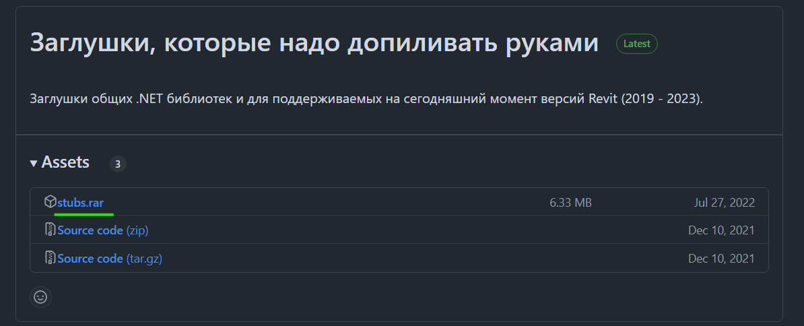
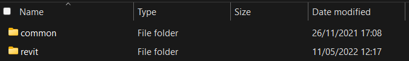
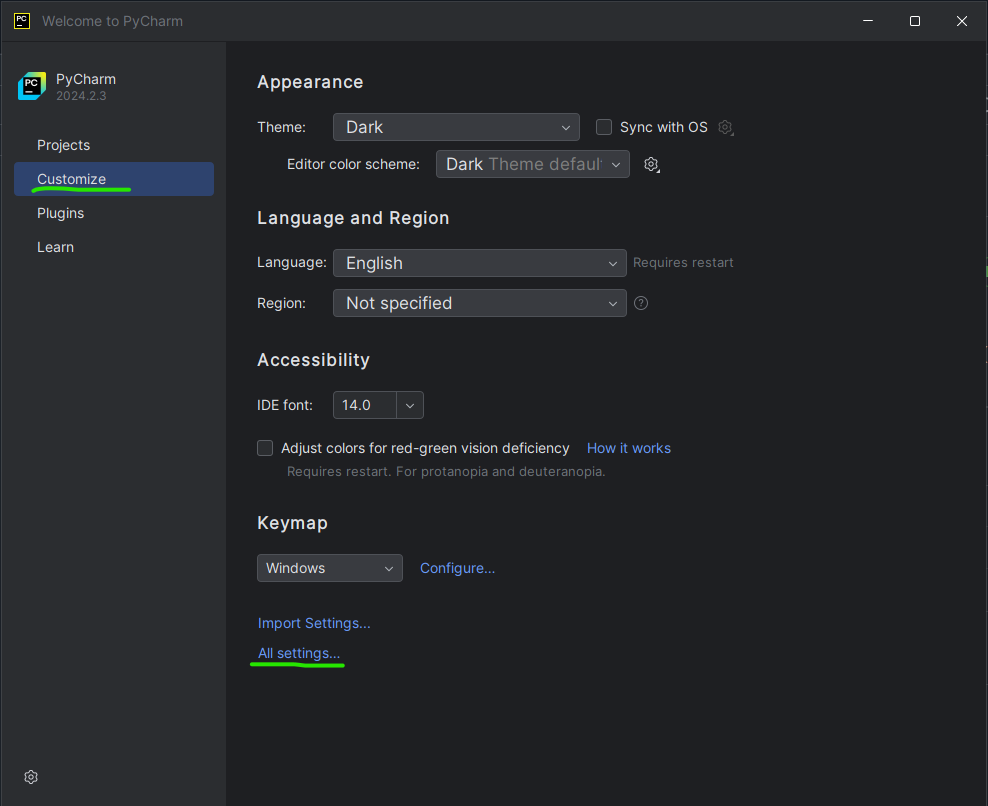

[PyCharm](https://www.jetbrains.com/pycharm) - это IDE для разработки на Python
с поддерживаемой бесплатной версией (Community Edition).

## Установка

Перейдите по [ссылке](https://www.jetbrains.com/pycharm/download/?section=windows) на официальный сайт и скачайте установочный файл `PyCharm Community Edition`.


 Запустите его и следуйте инструкциям по установке. Выберите следующие опции:


После установки `перезапустите ПК`

## Настройка

### Добавление RevitAPIStubs

Скачайте архив с RevitAPIStubs по [ссылке](https://github.com/BIMOpenGroup/RevitAPIStubs/releases/latest). В этом архиве находится python код,
который помогает PyCharm делать подсказки по API Revit.



Распакуйте содержимое архива. Папки `common` и `revit`:



### Добавление интерпретаторов

Перед тем, как добавлять интерпретаторы, убедитесь, что на вашем ПК установлена сама платформа [Bim4Everyone](../../install/_index.md).

В главном окне при запуске PyCharm перейдите в раздел `Customize -> All settings`:



Затем перейдите в раздел `Python Interpreter -> Show All`


Нажмите `+` чтобы добавить интерпретатор:


В открывшемся окне выберите раздел Virtual Environment. В качестве Base interpreter укажите путь к `python.exe`
(`python2.7` который вы устанавливали выше). Т.к. stub файлы различные для каждой версии Revit,
то под каждую версию Revit необходимо создавать свой интерпретатор.
Соответственно, надо создать папки для интерпретаторов под все версии Revit, которые установлены у вас.
При добавлении очередного интерпретатора указывайте соответствующую папку в `Location`.


Затем необходимо настроить пути для каждого интерпретатора. Чтобы открыть окно настроек, нажмите ПКМ на интерпретатор и 
выберите `Show Interpreter Paths`:


Для каждого добавленного интерпретатора необходимо `добавить 4 пути`:

- путь к соответствующим stubs файлам из архива, находящимся в revit/20xx (будет разный для каждого интерпретатора).
- путь к common файлам также из архива (будет одинаковый для всех интерпретаторов).
- путь к папке `%AppData%\pyRevit-Master\pyrevitlib` (будет одинаковый для всех интерпретаторов), 
    которая создается при установке pyRevit.
- путь к папке `%AppData%\pyRevit\Extensions\BIM4Everyone.lib` (будет одинаковый для всех интерпретаторов),
    которая создается при установке платформы Bim4Everyone.


### PyCharm custom properties

Перейдите в раздел `Edit Custom Properties`:


И замените весь существующий текст на следующий:

```
#---------------------------------------------------------------------
# Maximum file size (kilobytes) IDE should provide code assistance for.
# The larger file is the slower its editor works and higher overall system memory requirements are
# if code assistance is enabled. Remove this property or set to very large number if you need
# code assistance for any files available regardless their size.
#---------------------------------------------------------------------
idea.max.intellisense.filesize=40000

#---------------------------------------------------------------------
# Maximum file size (kilobytes) IDE is able to open.
#---------------------------------------------------------------------
idea.max.content.load.filesize=40000

```
