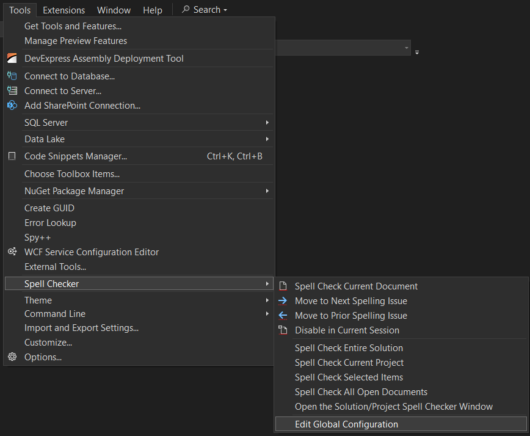
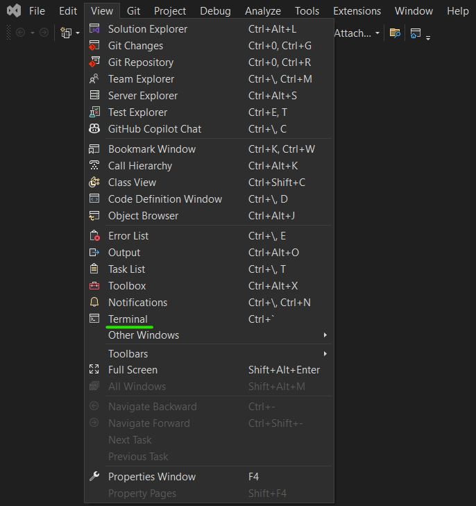

[Visual Studio](https://visualstudio.microsoft.com/) - это IDE для разработки на C#
с поддерживаемой бесплатной версией (Community Edition).

## Установка

Перейдите по [ссылке](https://visualstudio.microsoft.com/thank-you-downloading-visual-studio/?sku=Community&channel=Release&version=VS2022&source=VSLandingPage&cid=2030&passive=false)
на официальный сайт и скачайте загрузочный файл программы установки.
Запустите его и следуйте инструкциям по установке Visual Studio Installer.
Когда появится окно для установки Visual Studio Community 2022 выберите следующие опции:

В Workloads выберите `.NET desktop development`:


В Language packs выберите `English`:


После завершения установки рекомендуется `перезапустить ПК`.

## Настройка аккаунтов в Visual Studio

При первом запуске справа снизу выберите `Continue without code`:


В правом верхнем углу нажмите `Sign in`:


В появившемся окне выберите свой аккаунт Microsoft и введите пароль.
Создайте аккаунт, если у вас еще нет аккаунта Microsoft. Далее добавьте аккаунт GitHub.
Если вы еще не зарегистрировались на GitHub, сделайте это:


## Настройка текстового редактора

Перейдите в `Tools -> Options` и задайте настройки, которые будут вам удобны.


Пример настроек текстового редактора (`Text Editor`):


## Настройка автоформатирования при сохранении

Чтобы код автоматически форматировался в соответствии с [.editorconfig](https://editorconfig.org/), необходимо включить флаг в настройках:


Нажав на `Configure Code Cleanup` можно задать дополнительные действия:


## Установка плагинов для Visual Studio

Перед установкой плагинов необходимо `закрыть Visual Studio`.

### Установка Visual Studio Spell Checker

Данный плагин делает проверку орфографии.

Перейдите на [страницу](https://marketplace.visualstudio.com/items?itemName=EWoodruff.VisualStudioSpellCheckerVS2022andLater)
плагина, в Marketplace и скачайте установочный файл.
Запустите его и следуйте инструкциям по установке.

Чтобы открыть настройки плагина, прейдите в `Tools -> Spell Checker -> Edit Global Configuration`:



Добавьте словари английского и русского языка:


Настройте опции проверки орфографии:


`Сохраните настройки`.

#### Добавление слов в словарь исключений

Чтобы добавить слово в словарь исключений необходимо нажать `Alt+Enter`:


На момент написания этой инструкции в плагине есть `особенность`: нельзя сразу добавить слово в словарь,
если это слово - название класса/пространства имен и прочее:


Обойти это можно, написав комментарий с этим словом, и добавив слово из комментария:


### Установка Editor Guidelines

Данный плагин отображает максимальную длину строки в виде вертикальной линии.

Перейдите на [страницу](https://marketplace.visualstudio.com/items?itemName=PaulHarrington.EditorGuidelinesPreview)
плагина, в Marketplace и скачайте установочный файл.
Запустите его и следуйте инструкциям по установке.

Чтобы настроить цвет линии, перейдите в `Tools -> Options -> Environment -> Fonts and Colors -> Guideline`:


### Установка VSColorOutput64

Данный плагин раскрашивает консольный вывод в цвета по типу сообщения вывода.

Перейдите на [страницу](https://marketplace.visualstudio.com/items?itemName=MikeWard-AnnArbor.VSColorOutput64)
плагина, в Marketplace и скачайте установочный файл.
Запустите его и следуйте инструкциям по установке.

Чтобы настроить плагин, перейдите в `Tools -> Options -> VSColorOutput64`:


## Установка dotnet tools

Чтобы установить [dotnet tools](https://learn.microsoft.com/en-us/dotnet/core/tools/global-tools), 
откройте [powershell](https://learn.microsoft.com/en-us/powershell/scripting/windows-powershell/starting-windows-powershell?view=powershell-7.4).
Это можно сделать сразу в Visual Studio. Для этого перейдите в `View -> Terminal`:



### Установка powershell tool

```
dotnet tool install --global PowerShell
```

### Установка nuke tool

[Nuke](https://nuke.build/) - это утилита для автоматизации сборки и публикации проектов.

```
dotnet tool install --global Nuke.GlobalTool
```
