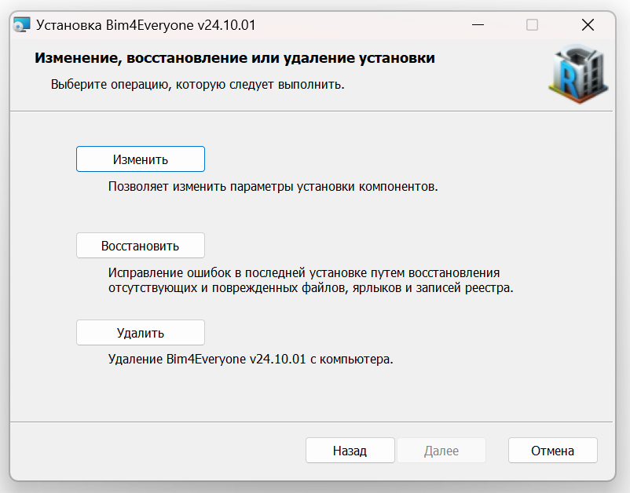
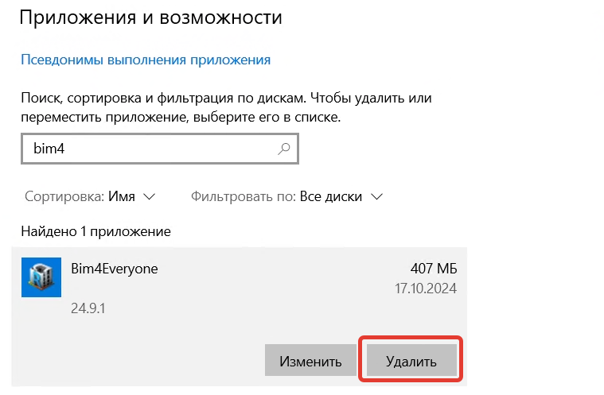

Для удаления платформы Bim4Everyone есть два способа.

## Удаление с помощью установщика

Удалить платформу можно с помощью установщика той версии платформы, которая у вас установлена на данный момент.
Для этого запустите файл-установщик, нажмите в окне кнопку "Удалить" и следуйте инструкциям.

## Удаление средствами Windows

Платформу можно удалить в окне "Приложения и возможности" в параметрах Windows (название может отличаться 
в разных версиях Windows).

Для этого требуется открыть окно "Приложения и возможности", найти платформу Bim4Everyone и нажать "Удалить".

