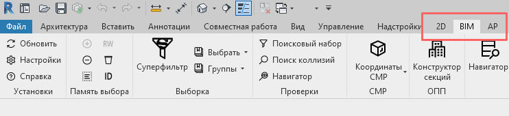

# Установка платформы Bim4Everyone

Для установки требуется выполнить следующие шаги:

1. Скачать актуальный файл-установщик с [GitHub](https://github.com/Bim4Everyone/Bim4EveryoneSetup/releases/).
   У платформы есть версии, которые указываются в формате "v00.00.00". 
Подробнее про версии и их обновление можно узнать в статье про [обновление платформы](../update).
2. Перед установкой требуется закрыть все окна программы Revit.
3. Запустить файл-установщик на вашем компьютере.
4. Следовать инструкциям установщика. 

   В процессе установки можно выбрать необходимые вам вкладки.
Рекомендуется выбирать первый вариант, если вкладку требуется установить.

5. При первом запуске Revit после установки откроется окно с заголовком "Безопасность" и вопросом про надстройку 
pyRevit. Необходимо выбрать вариант "Всегда загружать".

6. После этого на ленте Revit должны появиться выбранные при установке вкладки. 
Если все вкладки отсутствуют, то рекомендуется провести восстановление платформы (см. следующий раздел этой статьи).

7. В дальнейшем включить/выключить вкладки платформы можно с помощью [настроек](../setup).

# Восстановление платформы Bim4Everyone

Если повторно запустить установщик той версии платформы, которая у вас установлена, то вам будет предложено изменить, 
восстановить и удалить платформу.

Восстановление платформы поможет исправить ошибки, которые возникли при установке или при отсутствии обновлений.