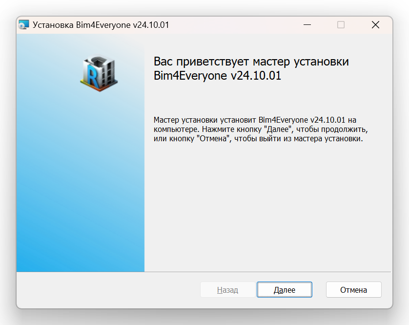
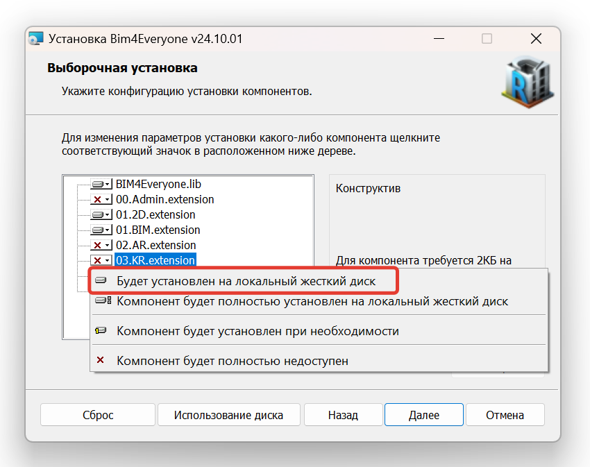
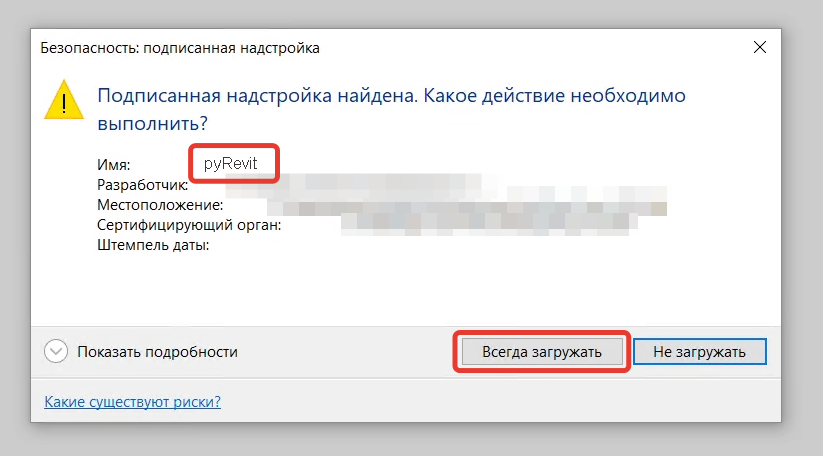

Для установки платформы Bim4Everyone необходимо:

1. Скачать актуальный файл-установщик с [GitHub](https://github.com/Bim4Everyone/Bim4EveryoneSetup/releases/).
2. Перед установкой требуется закрыть все окна программы Revit.
3. Запустить файл-установщик на вашем компьютере.
4. Следовать инструкциям установщика. В процессе установки можно выбрать необходимые вам вкладки.

5. При первом запуске Revit после установки откроется окно с заголовком "Безопасность" и вопросом про надстройку pyRevit. Необходимо выбрать вариант "Всегда загружать".

7. После этого на ленте Revit должны появиться выбранные при установке вкладки.

8. В дальнейшем включить/выключить вкладки платформы можно с помощью [настроек](../setup).

