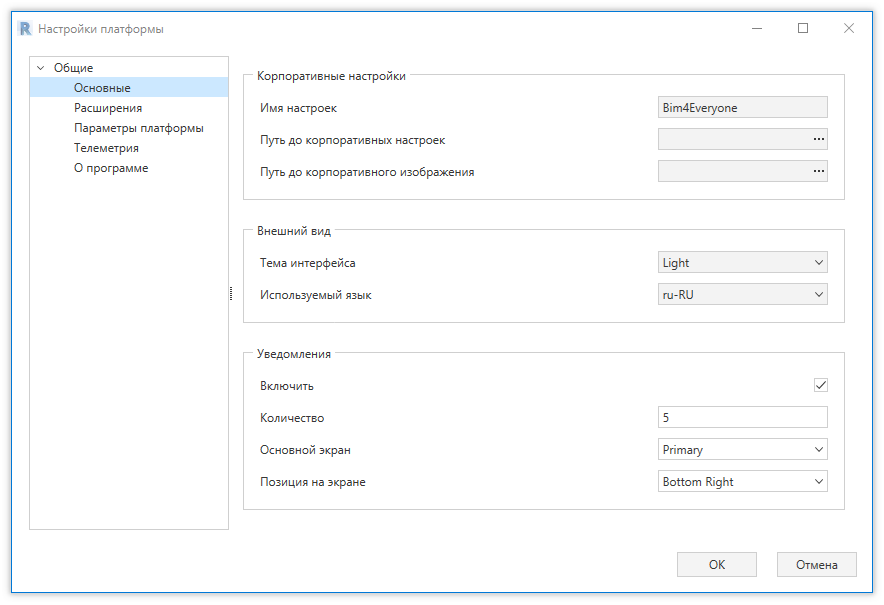
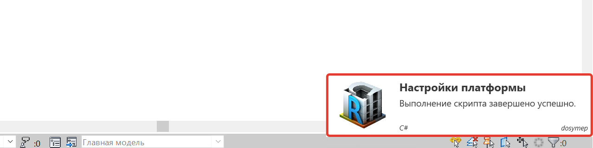
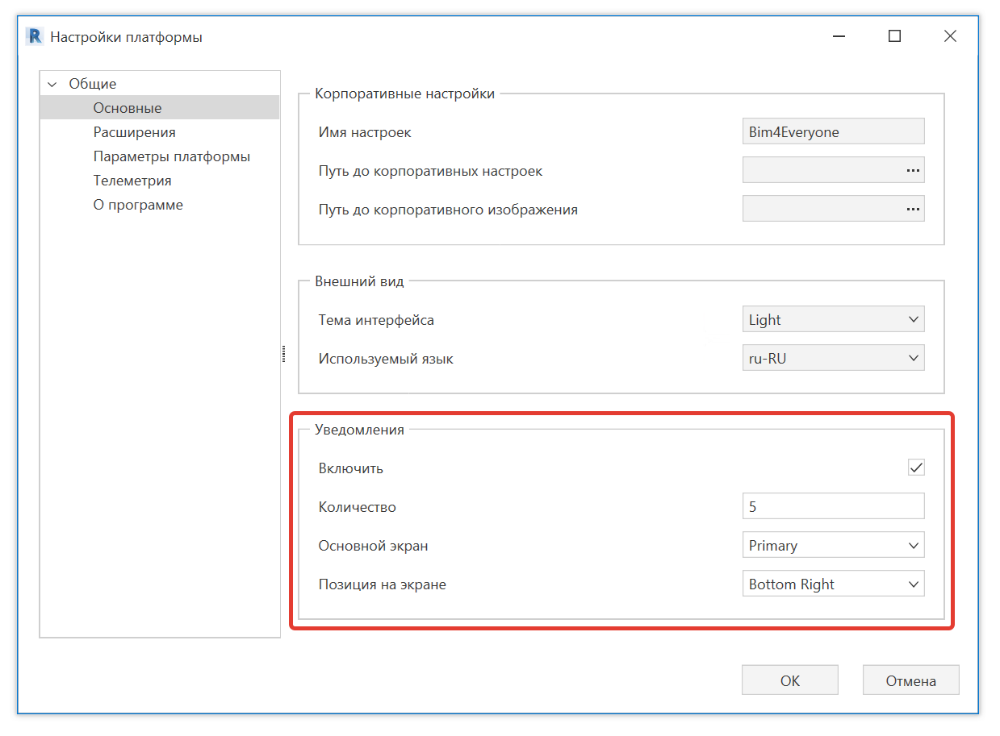
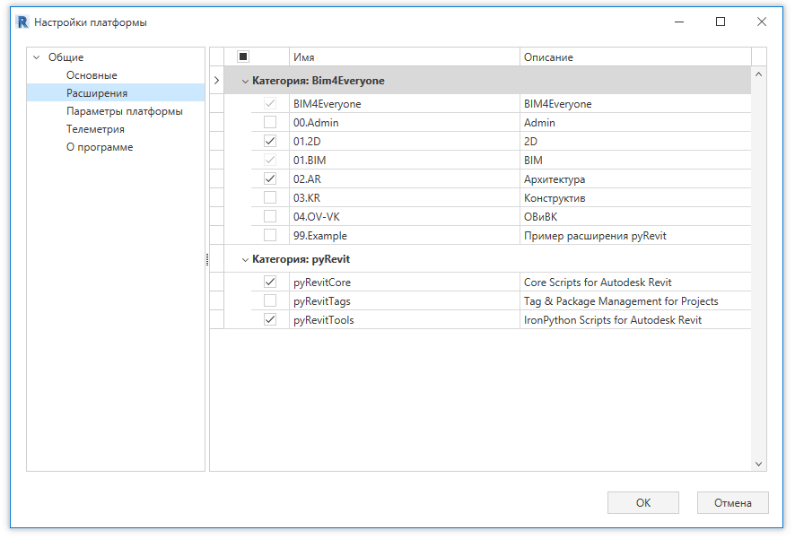

Для настройки платформы используется окно настроек. 
Данное окно можно открыть с любой вкладки платформы, нажав кнопку "Настройки" на панели "Установки".

В данном окне можно изменить глобальные настройки платформы, настройки вкладок, настройки телеметрии и т.д.

## Раздел "Основные"

В данном разделе можно настроить основные свойства платформы. Например, внешний вид и уведомления.

### Уведомления

При выполнении скриптов платформы в правом нижнем углу Revit всплывают уведомления. 

В подразделе "Уведомления" можно настроить окна уведомлений: задать максимальное количество, задать основной экран, 
выбрать местоположение уведомления.

Для включения/отключения уведомлений необходимо нажать на галочку в строке "Включить".

## Раздел "Расширения"

В данном разделе с помощью галочек можно включить/выключить необходимые вкладки платформы.
Здесь доступны вкладки Bim4Everyone и pyRevit.

