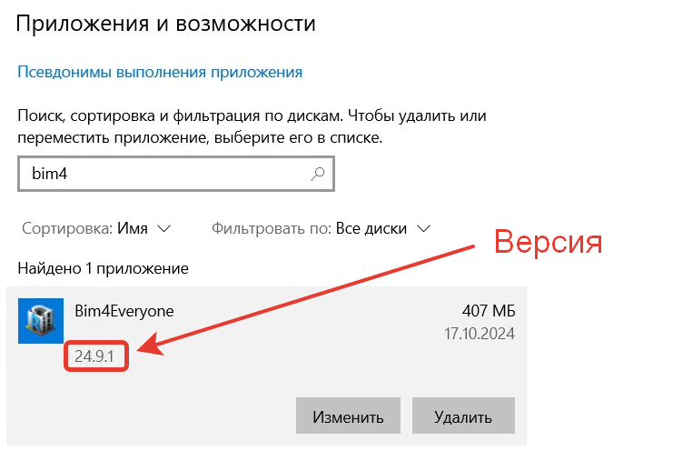

Платформа состоит из двух основных частей - скриптов и самой платформы (созданной на основе pyRevit), 
которая используется всеми скриптами. Для стабильной работы платформы рекомендуется вовремя обновлять каждую из частей.

## Версии платформы

Версии платформы указываются в формате "v00.00.00". Версия прописывается в имени файла установщика и 
видна в процессе установки. Текущую версию можно узнать в окне "Приложения и возможности" в параметрах Windows 
(название может отличаться в разных версиях Windows).

Версия платформы соответствует "внутренней" части платформы, при этом версии скриптов обновляются независимо от версии 
самой платформы.

## Обновление скриптов платформы

Скрипты платформы обновляются автоматически после публикации обновлений. 
Для обновления сначала необходимо закрыть все экземпляры Revit на вашем компьютере и затем заново открыть Revit.

При каждом новом запуске Revit автоматически подгружает актуальные версии скриптов. 

> Рекомендуется перезагружать Revit не реже одного раза в день!

## Обновление платформы

Обновления платформы выходят первого числа каждого месяца и доступны для скачивания на Github. 

Для установки обновлений необходимо запустить новый файл-установщик (аналогично [установке платформы](../install)) 
и следовать его инструкциям. 